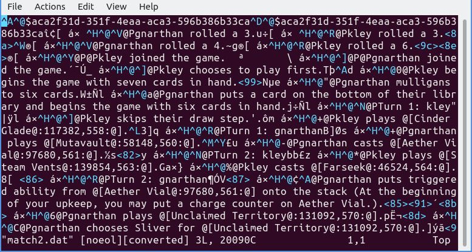

# Portfólio - Projetos de Data Science

Neste espaço, descrevo alguns dos projetos que desenvolvi por estudo ou por hobby (se é que há diferença :smile:) em que demonstro algumas tecnologias utilizadas em data science.  
Algumas das minhas ferramentas *"go-to"* são:
- Python
    - Pandas
    - Numpy
    - Scikit-learn
    - Matplotlib
    - Plotly
    - Flask
    - Dash
    - BeautifulSoup
    - Scrapy
    - PySpark
    - ...
- SQL e NoSQL
    - SQLite
    - PostgreSQL
    - MongoDB

Todos os projetos estão abertos para sugestões.

# Jupyter Notebooks

Conforme eu for estudando novas tecnologias, tentarei ir adicionando alguns notebooks ilustrando alguns exemplos de uso para consolidar os conceitos.

## PySpark

Para trabalhar com documentos maiores, senti necessidade de adicionar alguma ferramenta de Big Data ao meu repertório. Assim, pela familiaridade com Pandas, escolhi me familiarizar com o PySpark.

No notebook [example_notebooks/spark_mongo.ipynb](example_notebooks/spark_mongo.ipynb) demonstro como conectar o PySpark com o MongoDB para ler e escrever nos clusters.  
Também demonstro um pouco da sintaxe para queries e algumas visualizações com Plotly.

Como o notebook contém gráficos interativos, [visualize a versão renderizada aqui.](https://nbviewer.jupyter.org/github/tkleyton/portfolio_data-science/blob/master/example_notebooks/spark_mongo.ipynb)

# AceleraDev - Data Science

O AceleraDev - Data Science foi um programa de aceleração em Data Science realizado pela [Codenation](https://www.codenation.dev/).

Os participantes têm acesso a video-aulas e outros conteúdos e, semanalmente, resolvem desafios propostos para aplicar os conhecimentos adquiridos naquela semana.

## [O repositório](https://github.com/tkleyton/codenation)

No repositório estão disponibilizadas as minhas soluções para os desafios semanais com uma breve descrição.

Cada um dos desafios acompanha um README contendo instruções para a realização do desafio.  
Muitos dos desafios são propostos/realizados em Jupyter notebooks. A grande maioria destes estarão nomeados como "main.ipynb".  
Alguns dos README contém apenas instruções para obtenção dos dados. Nesses casos, as questões estão no próprio Jupyter notebook do desafio.

Onde for relevante, os datasets são manipulados utilizando Python Pandas, Numpy, Scikit-learn e Scipy.stats.

Seguem os links para os desafios individualmente listando alguns dos conceitos estudados:

## Por conteúdo
### Noções de estatística
- [Conhecendo melhor nossa base de consumidores: qual estado possui os clientes com melhores pontuações de crédito?](coestatistica-1)
    - Média, mediana, moda, desvio padrão, agregação de dados.
    
- [Funções de probabilidade](https://github.com/tkleyton/codenation/data-science-1)
    - Distribuições de probabilidade (normal e binomial), função de distribuição acumulada (CDF), CDF empírica (ECDF), quantis, padronização.
    
- [Funções de probabilidade 2](https://github.com/tkleyton/codenation/data-science-2)
    - Testes de hipóteses (Shapiro-Wilk, Jarque-Bera, D'Agostino-Pearson), qq-plots.
    
### Pré-processamento de dados
- [Redução de dimensionalidade e seleção de variáveis](https://github.com/tkleyton/codenation/data-science-3)
    - Redução de dimensionalidade, PCA, seleção de variáveis, RFE.
    
- [Feature engineering](https://github.com/tkleyton/codenation/data-science-4)
    - Processamento de texto, binning, one-hot encoding, pipelines, imputação, detecção de outliers.
    
### Juntando tudo
- [Descubra as melhores notas de matemática do ENEM 2016](https://github.com/tkleyton/codenation/enem-2)
    - Análise exploratória de dados (EDA), pré-processamento dos dados, feature engineering, clusterização (k-Means), visualização interativa de dados, regressão, GridSearch.
    - Neste notebook, algumas visualizações interativas não são renderizadas pelo GitHub. Você pode [visualizá-las aqui.](https://nbviewer.jupyter.org/github/tkleyton/codenation/blob/master/enem-2/main.ipynb)
    
- [Descubra quem fez o ENEM 2016 apenas para treino](https://github.com/tkleyton/codenation/enem-4)
    - Análise exploratória de dados (EDA), pré-processamento dos dados, feature engineering, tratamento de dados desbalanceados (SMOTE), modelos de classificação, modelo de votação de classificadores.
    
- [Recomendação de Leads (Projeto Final)](https://github.com/tkleyton/codenation/projeto_final)
    - Pode ser dividido em 3 etapas:
        1. [Pré-processamento dos dados](https://github.com/tkleyton/codenation/projeto_final/preprocessing.ipynb)
        2. [Aplicação do modelo de recomendação](https://github.com/tkleyton/codenation/projeto_final/model.ipynb)
        3. [Visualização dos resultados](https://github.com/tkleyton/codenation/projeto_final/visualization.ipynb)
            - Aqui também há o problema da renderização de gráficos interativos no GitHub. Você pode visualizar o notebook [aqui.](https://nbviewer.jupyter.org/github/tkleyton/codenation/blob/master/projeto_final/visualization.ipynb)
            - Alternativamente, realizei o deploy destes mesmos gráficos em um [Dash no Heroku](https://leads-generator-dash.herokuapp.com/). O código-fonte pode ser encontrado [aqui.](https://github.com/tkleyton/aceleradev-leads-dash) 

---

# Web-scraping

Desenvolvi alguns pequenos projetos de web-scraping.

## [Magic: The Gathering Metagame](https://github.com/tkleyton/mtg_meta)

Nada melhor que envolver os estudos com um hobby.  
Utilizei `requests` e `BeautifulSoup` para extrair informações sobre as estratégias mais populares do jogo de cartas *Magic: The Gathering*, um pouco de REGEX para limpar os dados, montei um DataFrame com `pandas` e `Matplotlib` para visualizar estas informações.

Desta forma, sabendo mais sobre as estratégias que estão sendo mais utilizadas atualmente, posso tomar melhores decisões sobre que estratégia utilizar para ter melhores chances de vitória em eventuais torneios.

## Public Google Spreadsheet

Um conhecido precisava baixar um documento público em formato CSV.  
O documento em questão é uma [tabela CID-10](https://docs.google.com/spreadsheets/d/e/2PACX-1vQG13ojbnTnmoF_UF69QVA5OjOOjB57m-xam6Ac1RhsMkOnsLPCn57xcVqsZ33ZFdP17gD38z7M_m5o/pubhtml#) que contém dados relacionados à saúde.  
Para gerar o arquivo csv, costuma-se bastar adicionar `pub?output=csv` ao final da URL. Porém, neste caso, a tabela contém diversas abas.

[Neste Jupyter nootebook](https://github.com/tkleyton/pubhtml_scraper), mostro como utilizei `requests`, `BeautifulSoup` e REGEX para extrair os IDs das abas para baixá-las individualmente como CSV.

## Discursos proferidos na câmara dos deputados

Inicialmente, escrevi um script utilizando os pacotes `requests` e `BeautifulSoup` para extrair as informações e coloquei em um loop para navegar pelas páginas.  
Os dados extraídos foram sendo adicionados a um `pandas DataFrame`.    
O código pode ser [visto aqui.](https://github.com/tkleyton/camara-scraper)

Mas eu ainda não estava satisfeito com o desempenho do script.  
Eu gostaria de ter algo mais automatizado para ir para as próximas páginas e que não precisasse esperar as requisições de cada entrada para ir para a seguinte, já que para cada discurso eu precisaria acessar uma nova página para extrair as informações relevantes (se ficou confuso, é mais fácil [olhar o site](https://www.camara.leg.br/internet/sitaqweb/resultadoPesquisaDiscursos.asp?txOrador=&txPartido=&txUF=&dtInicio=01%2F01%2F2020&dtFim=16%2F08%2F2020&txTexto=&txSumario=&basePesq=plenario&CampoOrdenacao=dtSessao&PageSize=50&TipoOrdenacao=DESC&btnPesq=Pesquisar)).

Pensei em começar a estudar mais sobre paralelização para disparar várias requisições ao mesmo tempo, mas como um bom preguiçoso fui procurar soluções na [bola de cristal.](https://www.google.com/)

Depois de ler um pouco mais sobre ferramentas de web-scraping, me deparei com o [Scrapy](https://scrapy.org/) e refiz o script que ficou bem mais simples (de escrever), rápido e escalável.  
O código pode ser [visto aqui.](https://github.com/tkleyton/scrapy-discursos)

### Mais Scrapy

Para ajudar a consolidar o que estudei sobre `Scrapy`, desenvolvi mais um projeto simples para extrair palavras válidas no jogo de tabuleiro [Scrabble](http://www.allscrabblewords.com/).

[Neste scrapper](https://github.com/tkleyton/scrabble-words), utilizei a funcionalidade dos pipelines para salvar as palavras com *n* letras em *n* diferentes worksheets em um arquivo `.xls`.

---

Durante meu mestrado, parte da rotina envolvia visualizar e extrair informações de dados de caracterização elétrica dos transistores que eu fabricava no laboratório.  
Para isso, utilizávamos um software proprietário para a visualização e fitting dos dados, porém esse procedimento é manual e deveria ser repetido para diversos componentes.

Então meu workflow era:
- Importar os dados no software;
- Filtrar para a região de interesse;
- Aplicar uma regressão linear;
- Colocar os coeficientes obtidos em uma tabela no Excel;
- Repetir os passos acima para todos os dispositivos;
- Aplicar as fórmulas relevantes para obter a informação desejada.

Após um tempo, o procedimento tornou-se mais homogêneo e o número de dispositivos aumentou, o que fez com que este workflow tomasse um tempo grande que poderia ser melhor utilizado no laboratório.

Na época, escrevi scripts em Python para realizar os cálculos.  
Quando comecei a estudar Data Science, resolvi escrever um Jupyter notebook para ilustrar o workflow e como é fácil automatizar estes processos.

### [Transistor characterization](https://github.com/tkleyton/transistor_characterization_notebook)

Tecnologias utilizadas:
- Pandas
- Numpy
- Scikit-learn
- Matplotlib

---

# [Glassifier API](https://github.com/tkleyton/glassifier-api)

Neste projeto, tentei colocar em prática alguns dos meus tópicos de estudo:
- Processamento de imagens como `numpy arrays`;
- Clusterização (k-means);
- Aplicações REST com Flask-RESTful;
- Deploy de aplicações Flask na plataforma Heroku.

Escrevi a classe para estilizar imagens agrupando pixels similares, lembrando um vitral (daí o nome). Em cima disso, escrevi uma API no Flask onde o usuário pode enviar uma imagem para aplicar o filtro.

A API está hospedada no Heroku: <https://glassifier-api.herokuapp.com/>  
E de quebra, você ainda vê uma foto estilizada das minhas gatas tomando um ar :cat2:.

---

# [MTGO log scraper](https://github.com/tkleyton/mtgo_data_scraper)

Voltando ao meu hobby *Magic: The Gathering*, existe uma plataforma oficial para jogar online conhecida como **MTGO**.

Como existem diversos torneios (inclusive com premiações em dinheiro), os jogadores têm bastante interesse em maximizar suas chances de vitória.  
Uma abordagem é analisar seus dados de diversas partidas para identificar os pontos fortes e fracos de sua estratégia, além de ajudar a identificar quais são as estratégias que convertem estatisticamente em mais vitórias contra as estratégias dos adversários.

O software guarda os logs das suas partidas. Porém, o software é bastante antigo, e o jogo salva os logs em um formato binário que ele pode ler para gerar *replays* das partidas.

Estes logs, quando convertidos para UTF-8, têm esta cara:

Assim, normalmente, os jogadores mantêm registros manuais (como planilhas do Excel) para poderem gerar os dados para serem posteriormente analisados.

Pensando nisso, consultei alguns jogadores e escrevi um script para extrair algumas informações mais relevantes e armazenar em um formato mais fácil de ser lido, como JSON.

Assim, com esses dados, os jogadores poderiam extrair informações que auxiliam suas tomadas de decisão.  
Por exemplo, [neste notebook](https://github.com/tkleyton/mtgo_data_scraper/blob/master/mtgo_data_analysis.ipynb), verifiquei que a estratégia que eu utilizava tinha uma grande taxa de vitória entre os turnos 5-7, porém altas taxas de derrota fora desta faixa.

---

# Codewars

[O codewars](https://www.codewars.com/) é uma plataforma contendo diversos desafios de programação, sendo uma ótima ferramenta para estudar linguagens com a mão na massa.

Uma vez que você resolve um desafio, é possível ver e discutir as soluções enviadas pelos outros usuários. Assim, posso descobrir maneiras diferentes e mais eficientes de se resolver aquele tipo de problema.

Para não ir contra a ideia da plataforma, não é possível visualizar minhas soluções. Mas é possível ver os desafios que pratiquei aqui: <https://www.codewars.com/users/tkleyton/completed>

Até o momento, venho praticando Python, SQL e Julia.

---

# Contato

Continuarei adicionando mais itens à lista conforme forem surgindo os projetos.  
Se ficou com alguma dúvida sobre algum dos projetos, ou tem sugestões de melhoras, ou novas ideias, entre em contato!

<kleyton.torikai@gmail.com>
